# E-Commerce Full Stack Project Using Nodejs/Reactjs

This Project Related to Store Web Application Where User can Shopping products online.

# Project Dependencies

<ul>
<li>
Javascript (Express Framework )
</li>
<li>
Mongoose
</li>
<li>
Reactjs
</li>
<li>
JsonWebToken
</li>
<li>
RESTful Api's
</li>
<li>
RESTfull a Task Scheduling (Cron Jobs) To Automate Fetching News At Back-end
</li>
</ul>

# Features

<ul>
<li>
Automate Fetching Latest Products
</li>
<li>
Using Redux to Handle State Management Over the Application
</li>
<li>
Authentication With JWT
</li>
<li>
Add/Remove Products To Cart
</li>
<li>
Order Products Online
</li>
<li>
Add/Remove Products To Cart
</li>
  <li>
Process manger using pm2
  </li>
  <li>
Logging and debugging using winston/morgan</li>
  <li>
Central error handling
  </li>
   <li>
404 page not found  </li>
</ul>

# Project Workflow

<ul>
<li>
Setting up Database Migration
</li>
<li>
Start Creating Model And Controller
</li>
<li>
Create Apis & Request Validation
</li>
<li>
Setup My Schema Relationships Between Models
</li>
<li>
Start Writing my Controller Functionality
</li>
<li>
Communicate With Internal Api 
</li>
<li>
Start Create Front-end UI with Material-ui
</li>
<li>
Finished Authentication Senario With Token
</li>
<li>
Setup Work With Redux To Manage State
</li>
<li>
Create Higher Order Component ( Route Guard ) to Handle Unauthorized Users
</li>
<li>
Create Project Services To separate Fetching Data From Component
</li>
<li>
Makes Reusable Component That List Products
</li>
<li>
Creating User Orders Component
</li>
<li>
Test Best & Worst Cases Scenarios
</li>
</ul>

# Project Pictures

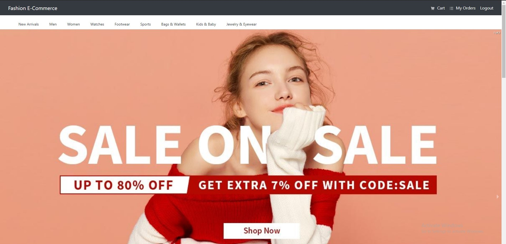
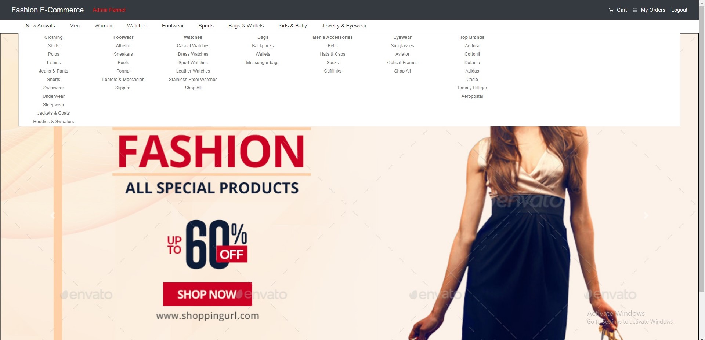
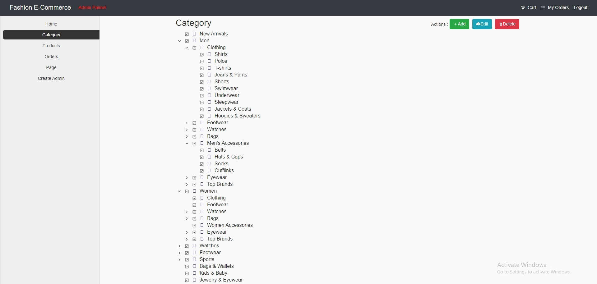
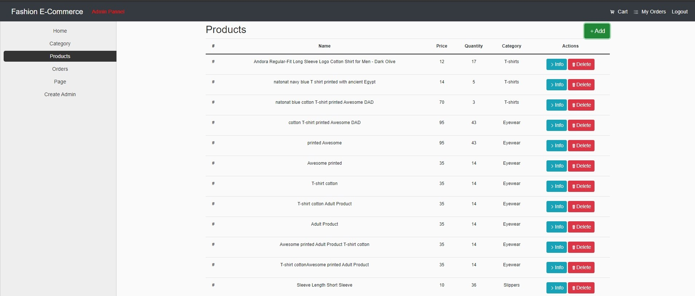

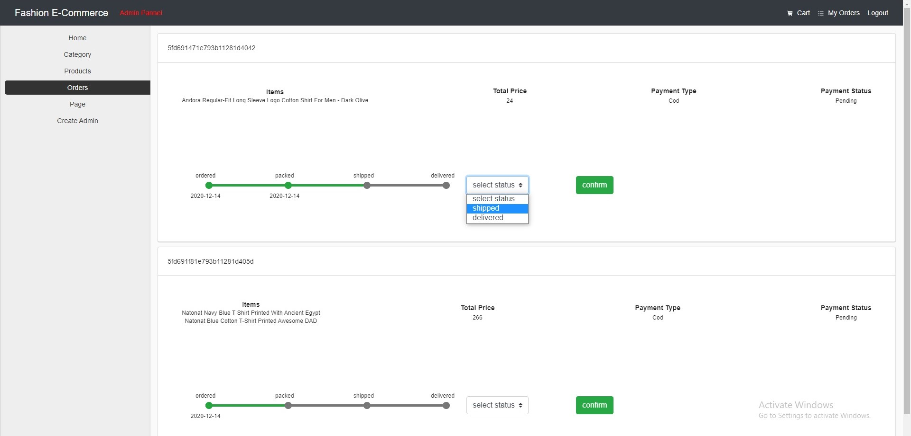
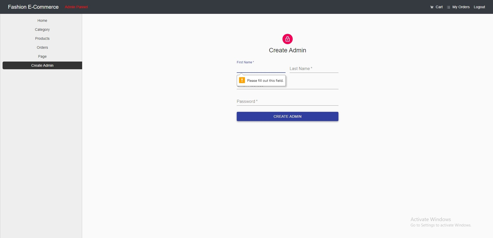
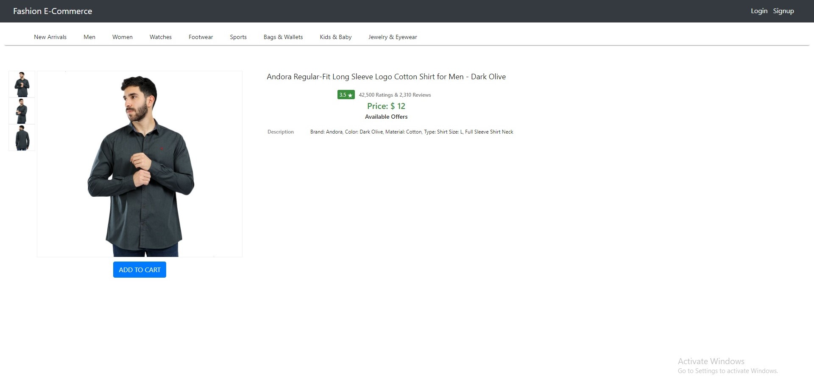
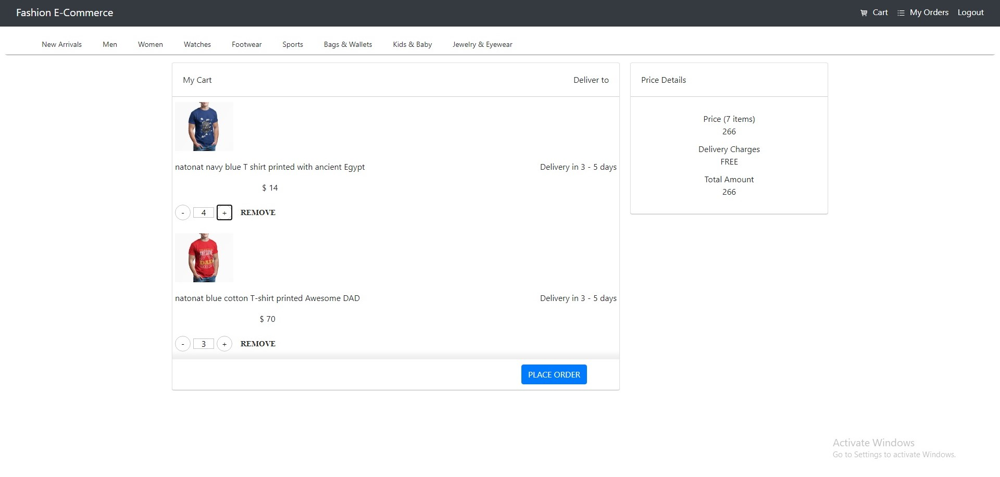
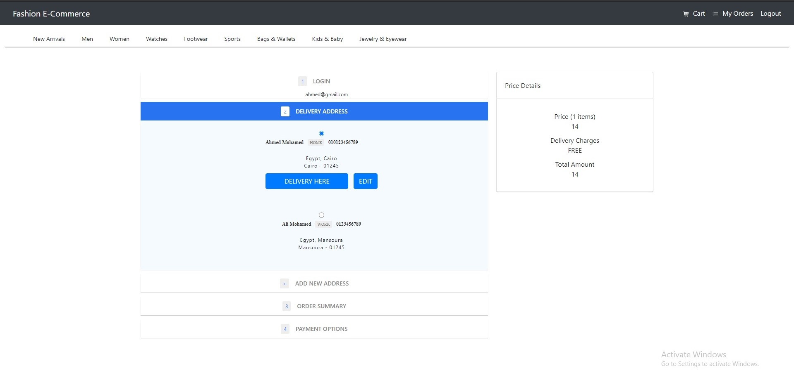
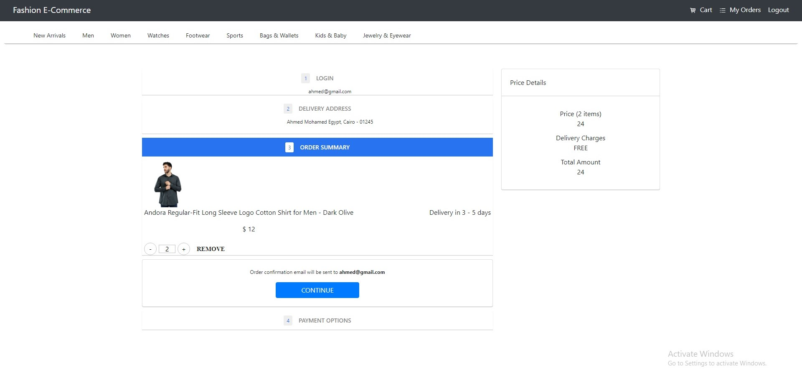
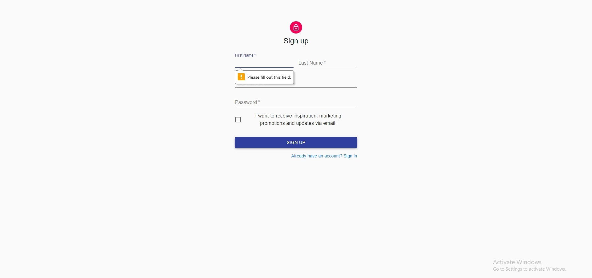
